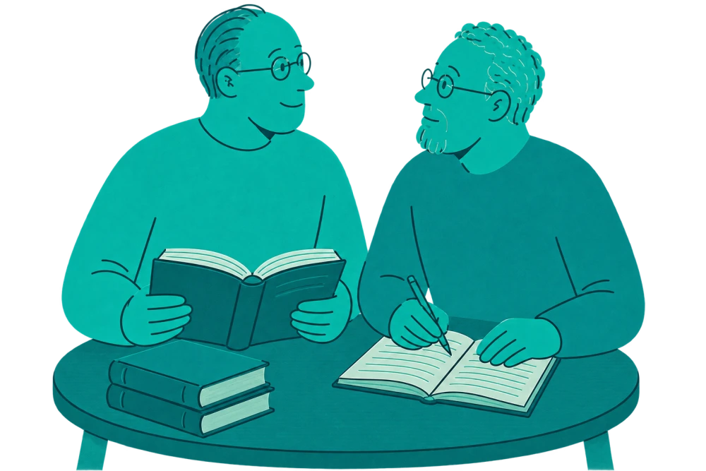
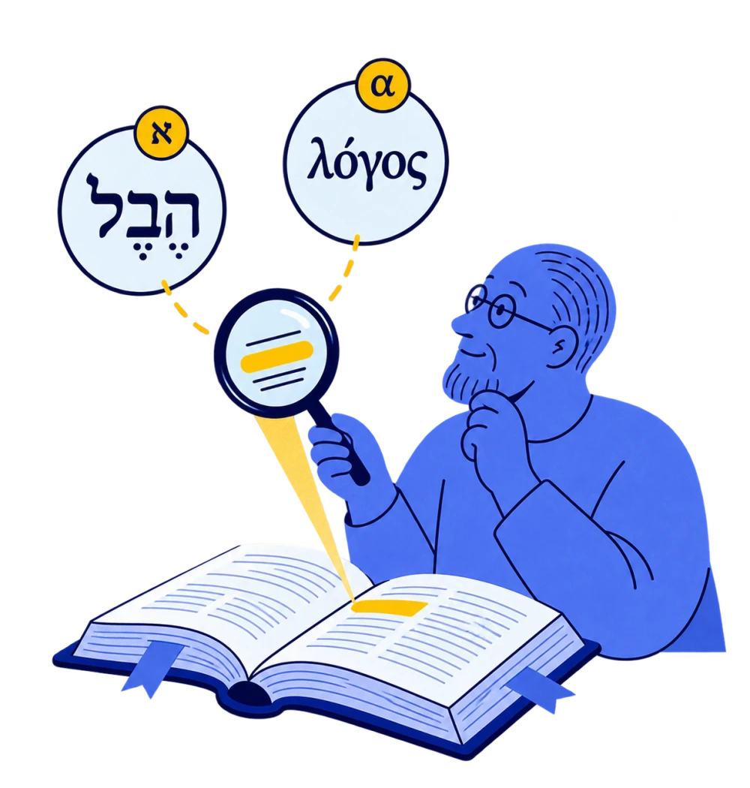
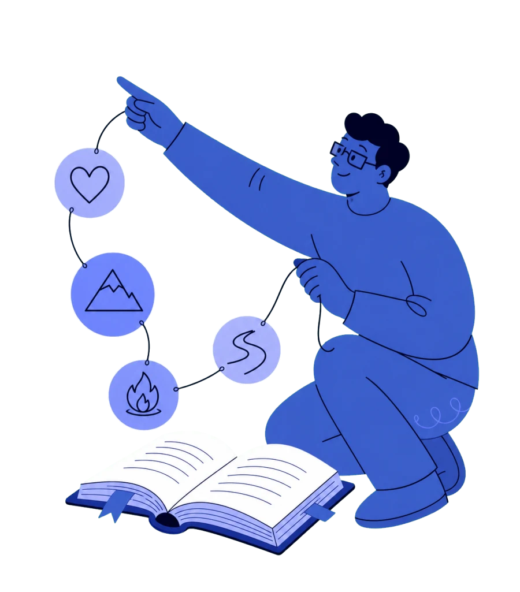

# Bible Strong Illustrated Worlds

**Identifier: `bible-strong-univers-v1` · Guide version: 1 · September 9, 2026**

The illustration chapter of the [Bible Strong Brand Guidelines](../charte-graphique.md). Also known as **Univers illustrés Bible Strong**, this guide formalizes the corpus supplied by the team and supports future creations. Examples are existing assets, not images newly generated for this documentation.

## Short Definition

**Flat-color 2D editorial illustration with expressive monochromatic characters, soft silhouettes, and fine detail lines.** A reading or study action, one main object, and a limited palette make each feature recognizable. The background is transparent.

“Without outlines” mainly describes the large silhouettes: their outer edges are usually defined by the fill. The corpus still uses lines around hands, faces, books, and accessories. Request **“no systematic outer outline, with fine internal detail lines”** rather than “no lines at all.”

## Style Invariants

| Dimension        | Rule for new images                                                                                                                                                                  |
| ---------------- | ------------------------------------------------------------------------------------------------------------------------------------------------------------------------------------ |
| Shapes           | Large rounded masses, soft volumes, simple and slightly organic geometry. Forms remain readable at small sizes.                                                                      |
| Characters       | Adults with stylized but coherent proportions: generous torso, rounded arms, expressive hands. Attentive, curious, or collaborative poses; avoid advertising poses.                  |
| Character colors | Skin and clothing share a color family, often the same flat fill. Colors are symbolic, not realistic skin tones.                                                                     |
| Faces            | A few curves for eyes, nose, and mouth. Glasses are common, not mandatory. Vary ages, hairstyles, silhouettes, and genders without requiring the same character in every scene.      |
| Lines            | Midnight-blue ink or a dark shade derived from the dominant color. Fine, soft, fairly consistent strokes with rounded ends, reserved for details, joints, and necessary separations. |
| Outlines         | No uniform thick outline around the entire silhouette. A book, hand, jaw, or accessory may be outlined for readability.                                                              |
| Books and paper  | Open or closed books, off-white or very pale pages, spaced curved lines suggesting text. Simple bookmarks and highlights.                                                            |
| Surface          | Flat fills dominate. Subtle grain or slight tonal variation can match some references, but should not become conspicuous texture or realistic modeling.                              |
| Depth            | Overlaps, shade changes, and simplified object perspective. No 3D rendering, studio lighting, or realistic cast shadows.                                                             |
| Narrative        | One explicit main action: compare two books, annotate, carry, connect, examine. The gesture explains the function.                                                                   |
| Setting          | Isolated subject, transparent background, few accessories. Useful books, links, and symbols replace detailed scenery.                                                                |
| Secondary motif  | Small loops on clothing may echo the references; they remain optional and discreet.                                                                                                  |

References are not perfectly uniform: `dictionary-universe-v3.webp` uses stronger lines; `commentaries-universe-v2.webp` has more texture and tonal variation. These differences do not justify thickening all lines or texturing every new scene.

## Color Worlds

Use one dominant color, one or two neighboring shades, dark ink, and light paper. A contrasting accent can emphasize the important gesture or connection. The families below are observed in the illustrations; they are not UI tokens or exact hexadecimal values. To match a color precisely, sample the reference file while excluding transparent pixels and antialiased edges.

| World            | Dominant color           | Accents and supporting colors                                         | Reference image                 |
| ---------------- | ------------------------ | --------------------------------------------------------------------- | ------------------------------- |
| Lexicon          | Strong blue              | Yellow for the examined word; very pale blue paper; midnight-blue ink | `lexicon-universe.webp`         |
| Comparison       | Violet                   | Lavender, deep violet, light pages                                    | `comparisons-universe.webp`     |
| Dictionary       | Yellow and orange        | Light pages, very dark ink                                            | `dictionary-universe-v3.webp`   |
| Commentaries     | Deep turquoise           | Teal, pale mint paper                                                 | `commentaries-universe-v2.webp` |
| Biblical themes  | Royal blue               | Periwinkle medallions, light pages, midnight-blue ink                 | `themes-universe-v2.webp`       |
| Bible references | Bright red               | White paper, very dark hair and lines                                 | `references-universe.webp`      |
| Relations        | Coral                    | Blue links, cream paper, midnight-blue ink                            | `relations-universe.webp`       |
| Online library   | Cyan and light turquoise | Blue links, light pages                                               | `online-library.webp`           |
| Offline library  | Orange                   | Yellow bag, strong orange books, light pages                          | `offline-library.webp`          |

For a feature absent from this table, explicitly choose a color family and record it in the brief. Do not present that choice as a mapping already established in the application.

## Reference Gallery

Thumbnails link directly to repository files. Their alpha channels have been verified; black shown by an image viewer is not an instruction to use a black background.

| Example                                                                                                                                                                    | What to carry forward                                                                                                                          |
| -------------------------------------------------------------------------------------------------------------------------------------------------------------------------- | ---------------------------------------------------------------------------------------------------------------------------------------------- |
|                                    | **Comparison:** the hands, two books, and symmetry communicate the action. A strong reference for simple flat fills.                           |
|                    | **Commentaries:** collaboration, reading, and note-taking; nearly monochromatic palette. Texture remains secondary.                            |
|  | **Dictionary, close framing:** one book and a shared gesture dominate. Lines are stronger than the corpus average.                             |
|     | **Dictionary, vertical framing:** a variation in pose and negative space. A composition variation is not a new style.                          |
|            | **Lexicon:** localized yellow accent, foreground book, and a visual metaphor for studying a word. Verify any added Greek or Hebrew separately. |
|                                  | **Offline library:** a carrying metaphor, solid masses, and few accessories.                                                                   |
|                             | **Online library:** shared reading and a single connection to the cloud.                                                                       |
|             | **Bible references:** a simple visual path on paper and a strong red dominant color.                                                           |
|                     | **Relations:** distinct documents, blue links, and explicit nodes; no embedded labels needed.                                                  |
|                       | **Themes, compact framing:** symbolic objects support one subject.                                                                             |
|                     | **Themes, spacious framing:** an extended gesture and negative space. Reduce the gesture span for small placements.                            |

This gallery is the requested style corpus, not an inventory of images currently displayed. For example, the site's worlds section uses `commentaries-universe-v3.webp` at the time of writing, while the supplied style reference here is v2. No asset replacement is implied.

## Composition and Integration

- For a card or small placement, choose one character, one main object, and one gesture. For a larger educational scene, two characters and a few related objects usually suffice.
- Define the aspect ratio and usable area before generation. Leave breathing room around hands, the book, and accessories. Cropping a torso at its base may be intentional; accidentally cropping a finger is not.
- Keep a genuinely transparent background. Preserve a PNG master with alpha, then a WebP export with alpha if required by its consumer. Do not flatten onto white or black during conversion.
- Inspect the cutout on light and dark backgrounds: no white fringe, colored halo, baked-in checkerboard, or stray pixels. Export defects are not part of the style, even if present in older assets.
- Check the image at its display size: details and fine lines must remain readable. For a tiny icon, use the application's icon system rather than shrinking a narrative scene.
- Keep titles, captions, and quotations in the interface. If a Greek or Hebrew word is essential to the metaphor, supply its exact spelling and check the output; avoid generated pseudo-letters.
- Preserve original references. Add a clearly named file without overwriting an existing illustration by default. Keep the master, exact generation prompt, and references discoverable.
- Use empty web alt text for decorative images. If an image provides necessary information, supply a short action description following the platform's accessibility conventions.

## Master Prompt

Attach one or two gallery images: the first for character drawing, the second if needed for palette or composition. Identify their roles. Text alone cannot guarantee style continuity; compare each output with the references.

```text
Usage: editorial illustration for Bible Strong.
Style: bible-strong-univers-v1, defined in the attached guide.
Reference 1: [file], drawing and character-treatment reference.
Optional reference 2: [file], [palette / composition] reference.
Subject: [one clear action related to reading or study].
Characters: [number, posture, and interaction].
Objects: [main object and essential accessories].
Palette: [world from the table], one dominant color and its shades,
very light paper, midnight-blue or matching dark ink,
one contrasting accent only if useful.
Drawing: flat-color 2D illustration, large rounded organic shapes,
monochromatic characters, skin and clothing in the same color family,
simple warm faces, expressive hands.
No systematic outer outline around silhouettes.
Keep fine, soft lines for faces, hands, folds, and books.
Depth through overlaps and a few secondary fills; clean surface.
Composition: [aspect ratio, placement, display size, and space to preserve].
Background: genuinely transparent, isolated subject without halos.
Text: no readable text, only a few lines suggesting pages.
Avoid: photography, 3D, realistic shadows, dominant gradients, thick outlines,
strong texture, tiny details, cluttered scenery, realistic skin tones,
logos, watermarks, fake transparency checkerboards.
Follow the references' visual language without copying their scene.
```

## Example Briefs

Append each brief below to the master prompt. These are examples for future generation, not illustrations already produced.

### A — A New Comparison Scene

```text
Reference: comparisons-universe.webp for style and palette.
Subject: a reader compares two versions of a passage.
One violet character leans slightly toward two open books,
with one finger on a line in each book. Focused, calm expression.
Dominant violet, lavender and deep-violet covers, very light pages.
Horizontal 3:2 format for a feature card; no other objects.
```

### B — A New Commentary Scene

```text
Reference: commentaries-universe-v2.webp for palette and interaction.
Subject: explaining a passage together.
Two turquoise adults, seen from the waist up. One points to a line
in the open book; the other writes a note on a small card.
Suggest a table with a flat shape.
Turquoise and teal, very pale mint paper; barely perceptible texture.
Horizontal 3:2 format; readable book and hands in the foreground.
```

### C — A New Offline Library Scene

```text
Reference: offline-library.webp for drawing and palette.
Subject: taking a personal library along.
An orange person slips a book into a yellow bag held against their body.
A second book peeks out; no phone, cloud, or scenery.
Dominant orange, yellow accent, off-white pages, fine midnight-blue lines.
Square format, centered subject with margins around the bag and hands.
```

### D — A New Personal Notes Scene

```text
Reference: relations-universe.webp for the character and documents.
Subject: recording a thought while reading.
A coral reader writes on a card beside an open book.
One hand writes while the other holds the page; calm expression.
Coral, cream paper, and a small blue bookmark. No network of links.
Square format for a supporting illustration.
The coral palette is proposed for this brief; it does not automatically
establish an official color for the Notes feature.
```

## Acceptance Check

1. The action and main object are understandable without a caption.
2. The dominant color matches the brief; characters and clothing share a color family.
3. Silhouettes rely on fills; fine lines explain details without a generalized thick outline.
4. Faces, hands, pages, and accessories are coherent; fingers and objects do not merge.
5. The image remains readable at its intended size and fits alongside existing references.
6. Alpha, margins, and edges are clean on light and dark backgrounds.
7. No invented text, unintended symbol, logo, or watermark has been added.
8. The final file, exact prompt, and references are preserved in the project.

To correct an output, name a specific deviation (“remove the thick outer outline, preserve face and hand detail lines”) and retain the other parameters. Avoid vague requests such as “make it flatter” or “remove outlines.”
