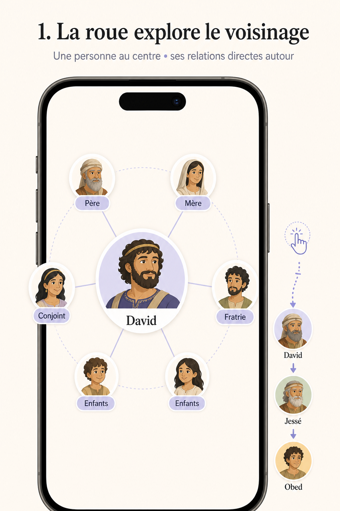
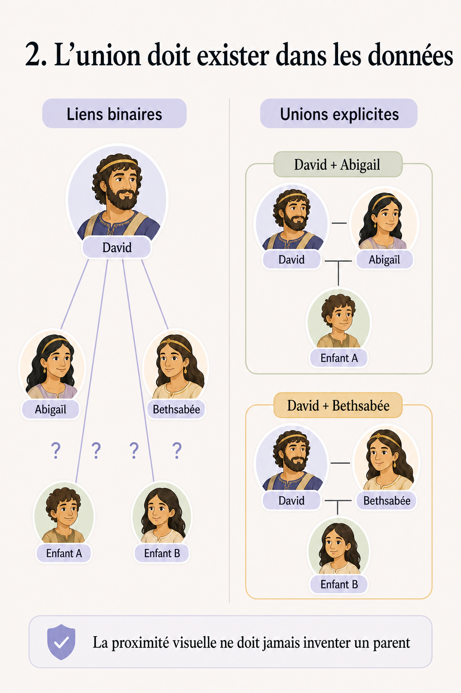
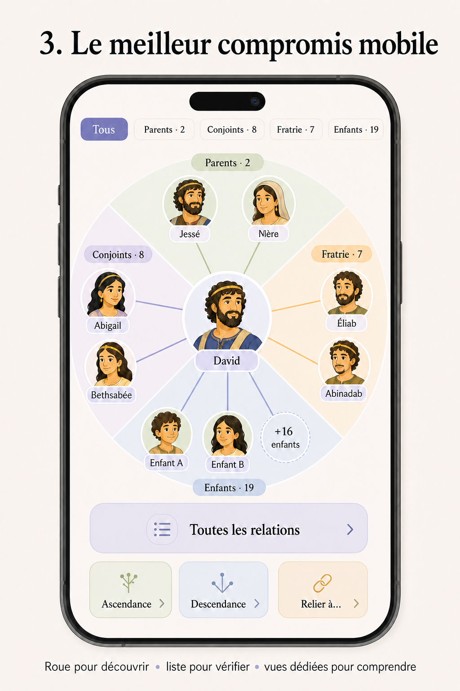

# Audit UX conceptuel — roue de relations des entités Strong

**Date :** 31 juillet 2026  
**Périmètre :** modèle mental et architecture d’information mobile. L’animation, le style visuel et la qualité d’implémentation ne sont pas audités ici.  
**Méthode :** lecture du comportement produit actuel dans le dépôt, comparaison avec des produits généalogiques officiels et avec des études HCI portant sur les arbres, graphes et interfaces mobiles hiérarchiques.

## Illustrations du concept

### 1. La roue comme explorateur de voisinage

### 2. La nécessité de modéliser explicitement les unions

### 3. Le concept hybride recommandé

## Verdict

La roue actuelle est un **bon concept principal sur mobile**, à condition de la définir correctement : ce n’est pas un arbre généalogique miniature, mais un **explorateur de voisinage relationnel centré sur une entité**.

Ce modèle est particulièrement adapté aux questions que l’utilisateur se pose depuis une fiche Strong :

- « Qui est directement lié à cette personne ? »
- « Quel est le lien entre ces deux entités voisines ? »
- « Si je passe à cette personne, qui trouve-t-on autour d’elle ? »
- « Puis-je suivre une chaîne de relations sans quitter le contexte ? »

Il est moins adapté aux questions globales :

- « Quelle est toute l’ascendance de cette personne ? »
- « Où se trouvent deux branches ou deux générations l’une par rapport à l’autre ? »
- « Quel est l’ancêtre commun de A et B ? »
- « Quels enfants appartiennent à quelle union ? » lorsque le modèle de données ne représente pas explicitement l’union.

Il ne faut donc pas remplacer la roue par un grand arbre pan/zoom. La meilleure architecture est **hybride** : roue locale par défaut, fiche/liste explicite comme représentation équivalente, puis vues spécialisées optionnelles pour une lignée ou un chemin entre deux personnes.

## Ce que le produit actuel modélise réellement

La lecture de `StrongEntityRelationGraph.tsx`, `strongEntityGraphLayout.ts` et `strongEntityPresentation.ts` montre le modèle suivant :

- une entité active au centre ;
- six relations visibles à la racine ;
- après navigation, cinq nouvelles relations plus un nœud réservé au retour ;
- pagination quand le nombre de voisins dépasse la capacité de la roue ;
- toucher un voisin le rend actif et recentre son propre voisinage ;
- conservation d’un historique permettant le retour et la réinitialisation ;
- priorité de tri : père, mère, conjoint, frère/sœur, enfant, puis autres relations.

Cette architecture est bien celle d’un **ego network**, ou graphe égocentré : le centre change et l’écran expose un voisinage de profondeur 1. Elle ne maintient pas en permanence une carte globale de la famille.

Cette distinction est importante pour les attentes. Le mot « arbre » promet une vue stable des générations et des branches. La roue promet une exploration de relations autour d’un centre. Pour éviter une attente trompeuse, le produit devrait parler de **« Relations de X »**, **« Famille autour de X »** ou **« Explorer les proches »**, et réserver « arbre » à une éventuelle vue de lignée.

## Pourquoi ce modèle fonctionne bien sur mobile

### 1. Il correspond à une tâche locale, pas à une réduction d’un écran desktop

Une roue de voisinage montre seulement ce qui est utile autour du centre. C’est une forme de divulgation progressive : la complexité totale du graphe n’est pas mise sur l’écran en même temps.

Ce principe est cohérent avec TreePlus, une interface d’exploration de réseaux qui part d’un nœud et étend le graphe à la demande. Dans une étude contrôlée à 28 participants, son avantage sur un graphe traditionnel augmentait avec la densité des données ; les participants déclaraient également davantage de confiance et préféraient majoritairement TreePlus. L’étude ne porte pas sur le mobile ni sur la généalogie, mais elle soutient l’idée d’une **exploration locale progressive** plutôt que d’un graphe global dense. [Microsoft Research — TreePlus](https://www.microsoft.com/en-us/research/publication/treeplus-interactive-exploration-networks-enhanced-tree-layouts/)

### 2. Elle encaisse naturellement un nombre variable de voisins

Plusieurs frères et sœurs, conjoints ou enfants produisent un grand *fan-out*. Un arbre node-link classique devient rapidement encombré dans ce cas. Une étude CHI comparant un arbre traditionnel, une liste avec défilement et une interface multicolonne a trouvé que les participants parcouraient et comprenaient plus vite les structures à fort fan-out avec les colonnes, qu’ils préféraient également. La leçon utile ici n’est pas d’adopter littéralement des colonnes sur téléphone, mais de **borner ce qui est visible et conserver un chemin explicite** au lieu d’ouvrir toutes les branches. [Microsoft Research — Comparative Evaluation for Large Fan-outs](https://www.microsoft.com/en-us/research/publication/comparative-evaluation-tree-visualization-methods-hierarchical-structures-large-fan-outs/)

Une étude mobile sur ERELT, un arbre radial montrant seulement un sous-ensemble lisible de la hiérarchie, a mesuré moins de temps et moins de touchers que des listes pour des tâches d’exploration et de recherche dans une collection musicale ; dans certains cas, le nombre de touchers était réduit de presque 50 %. La transposition doit rester prudente : une bibliothèque musicale est une hiérarchie pure, contrairement à une famille multi-conjoints. [Chhetri, Zhang & Jain — A mobile interface for navigating hierarchical information space](https://personal.utdallas.edu/~kzhang/Publications/JVLC2015ERELT.pdf)

### 3. Le recentrage correspond bien au raisonnement relationnel

Le passage « David → Salomon → Roboam » est une suite de voisinages locaux. Une interface centrée permet de suivre cette chaîne sans demander à l’utilisateur de paner et zoomer dans une carte beaucoup plus grande que son écran.

Le nœud de retour spatialement présent est particulièrement pertinent : il conserve la relation avec la personne quittée, tandis que le reste du voisinage se renouvelle. Le pied de page « retour » et « réinitialiser » complète ce mécanisme.

## Le point décisif : voisinage et pedigree ne répondent pas aux mêmes questions

| Représentation | Question principale | Forces | Faiblesses sur mobile |
|---|---|---|---|
| **Roue / voisinage centré** | Qui est lié directement à X, et où puis-je aller ensuite ? | Compacte, tactile, plusieurs types de liens, complexité progressive | Ne montre pas l’ensemble d’une lignée ; la position peut sembler porteuse de sens alors qu’elle ne l’est pas |
| **Arbre/pedigree pan-zoom** | Comment les générations et branches sont-elles organisées ? | Vue globale, continuité des générations, comparaison de branches | Navigation 2D, textes minuscules, fort fan-out, multi-conjoints difficiles |
| **Fan chart** | Quels sont les ancêtres directs de X ? | Très compact pour plusieurs générations | Exclut enfants, fratries, cousins et généralement les alternatives parentales |
| **Fiche centrée + sections** | Quels sont précisément les parents, unions, enfants et autres liens de X ? | Explicite, scalable, accessible, bonne pour l’édition | Faible compréhension spatiale ; chaînes relationnelles plus laborieuses |
| **Liste relationnelle** | Puis-je retrouver, filtrer ou comparer de nombreux individus ? | Recherche, tri, grands volumes, noms longs | N’illustre presque pas la topologie |
| **Graphe global libre/force-directed** | Quelles connexions existent dans tout le réseau ? | Peut représenter n’importe quel type de lien | Instable, croisements, occlusion, faible lisibilité des générations ; mauvais défaut mobile |
| **Chemin A → B** | Comment A et B sont-ils reliés ? | Réponse directe, explicite, peu encombrée | Ne donne pas de contexte familial général |

Les produits généalogiques établis confirment qu’aucune vue ne suffit à toutes les tâches :

- MyHeritage propose quatre vues distinctes. Sa vue « Family » expose le mieux la famille étendue, mais devient difficile avec de nombreux frères, sœurs et cousins ; au-delà de 50 individus, des branches sont masquées. Le pedigree et le fan chart simplifient l’ascendance directe mais excluent les proches collatéraux. La liste gère mieux les grands volumes, au prix de la topologie. [MyHeritage — Making the Most of Different Tree Views](https://education.myheritage.com/article/making-the-most-of-different-tree-views-on-myheritage/)
- FamilySearch affiche plusieurs générations dans sa vue portrait, mais traite les conjoints ou parents alternatifs par un contrôle secondaire et les fratries par expansion. [FamilySearch — Portrait pedigree view](https://www.familysearch.org/en/help/helpcenter/article/what-is-the-portrait-pedigree-view-in-family-tree)
- Pour une personne ayant plusieurs conjoints ou jeux de parents, FamilySearch montre tout dans la fiche de la personne mais un seul choix « préféré » dans les vues pedigree. C’est une concession explicite : la vue globale reste lisible en ne montrant pas simultanément toute la complexité. [FamilySearch — Connecting and Correcting Relationships](https://www.familysearch.org/en/help/helpcenter/article/connecting-and-correcting-relationships-in-family-tree)
- FamilySearch emploie encore une vue séparée pour répondre à « Comment suis-je relié à cette personne ? » : un chemin calculé, avec option d’afficher les conjoints. [FamilySearch — View My Relationship](https://www.familysearch.org/en/help/helpcenter/article/what-is-view-my-relationship-in-family-tree)

Le bon benchmark n’est donc pas « quelle vue gagne ? », mais « quelle vue répond le plus directement à la tâche en cours ? ».

## Limites conceptuelles de la roue actuelle

### 1. Les catégories de relation sont triées, mais pas véritablement structurées

Aujourd’hui, les relations sont ordonnées par type puis versées dans six positions successives. Les positions géométriques ne correspondent pas durablement à « parents en haut, partenaires à côté, enfants en bas ». Une personne avec beaucoup de frères/sœurs peut voir ses enfants repoussés sur une page ultérieure.

Conséquences possibles :

- l’utilisateur croit que l’emplacement d’un nœud code une génération alors que seul le libellé le fait ;
- une page « 1/3 » ne dit pas quelles catégories sont encore cachées ;
- la roue résout la densité physique, mais pas forcément la **trouvabilité sémantique** ;
- deux personnes ayant les mêmes relations peuvent produire des arrangements visuels différents selon le nombre de voisins précédents.

Un résultat expérimental invite à ne pas surinterpréter la compacité radiale : dans une tâche statique consistant à trouver le plus petit ancêtre commun, les arbres traditionnels et orthogonaux ont significativement surpassé l’arbre radial ; les participants vérifiaient davantage leurs réponses en radial. Cette tâche est globale et l’interface testée n’était pas interactive, donc elle ne condamne pas la roue actuelle. Elle montre simplement que le radial n’est pas meilleur pour lire une structure ancestrale. [Burch et al. — Evaluation of traditional, orthogonal, and radial tree diagrams](https://pubmed.ncbi.nlm.nih.gov/22034365/)

### 2. La pagination générique mélange capacité visuelle et architecture d’information

Une pagination de six éléments répond à « combien de nœuds tiennent à l’écran ? », mais pas à « quelles relations sont importantes pour comprendre cette personne ? ».

Exemple : un personnage a 2 parents, 3 conjointes, 12 enfants et 4 frères. Une pagination plate peut faire apparaître une conjointe sans les enfants liés à cette union, puis séparer les autres conjointes et enfants sur plusieurs pages. L’utilisateur sait qu’il y a d’autres éléments, mais ne sait pas ce qui manque avant de parcourir chaque page.

### 3. Une famille n’est pas un arbre pur et les liens binaires ne suffisent pas toujours

Le cœur du problème multi-conjoints/multi-enfants n’est pas seulement graphique. Il est sémantique : **de quelle union cet enfant est-il issu ?**

Si les données ne contiennent que les arêtes binaires :

- A — partenaire de → B ;
- A — parent de → C ;
- A — partenaire de → D ;
- A — parent de → E ;

alors aucune disposition visuelle ne permet de déduire avec certitude si C est l’enfant de B ou de D. La proximité dans la roue ne doit jamais fabriquer cette information.

Les formats généalogiques introduisent pour cette raison un regroupement de famille ou d’union. Dans GEDCOM 7, un enregistrement `FAM` relie les partenaires et ses enfants ; une personne peut participer à plusieurs familles comme conjoint/parent et appartenir à plusieurs structures parentales. La spécification reconnaît aussi les limites des affichages à deux partenaires et des modèles familiaux historiques. [FamilySearch GEDCOM 7 Specification](https://gedcom.io/specifications/FamilySearchGEDCOMv7.html)

Pour Bible Strong, cela conduit à deux choix honnêtes :

1. si la source connaît l’union parentale, la représenter comme un groupe explicite (`unionId`, couple/famille ou relation parentale commune) ;
2. si la source ne la connaît pas, afficher les conjoints et les enfants séparément sans suggérer leur rattachement.

La même règle vaut pour la fratrie : « frère/sœur » peut signifier même parent, même couple parental, demi-fratrie, adoption ou relation sociale. Le libellé ou la fiche doit exprimer le niveau de précision réellement connu.

### 4. Le chemin parcouru n’est pas nécessairement le chemin généalogique

L’historique actuel répond à « par où suis-je passé ? », ce qui est utile. Il ne répond pas automatiquement à « quelle est la relation calculée entre le point de départ et le centre ? ». Un parcours peut passer par un conjoint, revenir par un frère, ou former un cycle.

Il faut conserver cette distinction :

- **fil d’Ariane de navigation** = séquence des choix de l’utilisateur ;
- **chemin relationnel calculé** = explication généalogique entre A et B, potentiellement différente ;
- **lignée** = sous-graphe orienté ancêtres ou descendants.

## Architecture d’information recommandée

### Niveau 1 — conserver la roue comme entrée principale

La roue doit rester la représentation de découverte par défaut dans une fiche d’entité. Son contrat devrait être formulé ainsi :

> Le centre est la personne ou l’entité active. Autour d’elle se trouvent ses relations directes. Toucher un proche recentre l’exploration sur lui.

Cette phrase est plus exacte et plus enseignable que « voici son arbre généalogique ».

### Niveau 2 — transformer les types de relation en facettes visibles

Au lieu d’une seule suite paginée, exposer au minimum les totaux par catégorie :

- Parents · 2
- Conjoints · 3
- Frères et sœurs · 4
- Enfants · 12
- Autres relations · 2

Deux variantes sont cohérentes :

**Variante A — secteurs stables.** Parents toujours dans le secteur haut, fratrie latérale, conjoints latéraux, enfants en bas. Quand un secteur déborde, un nœud agrégé « +9 enfants » ouvre la catégorie.

**Variante B — roue filtrée.** Une rangée de catégories avec compteurs choisit le contenu de la roue ; « Tous » montre un échantillon équilibré, puis « Enfants · 12 » montre uniquement les enfants sur plusieurs pages.

La variante B est la plus robuste si les données comprennent aussi des lieux, groupes et relations non familiales. Elle évite de prétendre qu’une géométrie généalogique unique convient à tous les types d’entités Strong.

Dans les deux cas, l’architecture doit garantir qu’au moins une entrée vers chaque catégorie non vide est visible sans parcourir toutes les pages.

### Niveau 3 — offrir une représentation explicite équivalente

Une action « Voir toutes les relations » doit ouvrir une fiche ou une bottom sheet organisée par sections. Cette vue est indispensable, même si la roue reste la star :

- elle gère les noms longs et grands volumes ;
- elle expose clairement les catégories et leurs totaux ;
- elle peut grouper les enfants sous une union quand cette donnée existe ;
- elle sert d’alternative accessible à une structure visuelle complexe ;
- elle facilite recherche, tri et comparaison.

La roue et la liste ne sont pas deux fonctionnalités concurrentes. Ce sont deux représentations du même voisinage : **spatiale pour découvrir**, **explicite pour vérifier et retrouver**.

### Niveau 4 — ajouter seulement des vues spécialisées justifiées par une tâche

À envisager si les données le permettent :

- « Voir l’ascendance » : pedigree compact limité aux ancêtres directs ;
- « Voir la descendance » : arbre ou liste de descendance, avec unions explicites ;
- « Relier à… » : recherche d’une deuxième personne puis affichage d’un chemin A → B ;
- « Revenir à la personne d’origine » : action déjà proche du reset actuel.

À éviter comme défaut : un bouton « Voir tout le graphe ». Il promet une exhaustivité rarement lisible sur téléphone et transforme une tâche claire en navigation 2D.

## Traitement recommandé des cas difficiles

### Plusieurs frères et sœurs

- Afficher le compte de la catégorie avant le détail.
- Trier de façon explicable et stable, idéalement par ordre biblique/chronologique de la source si connu.
- Ne pas utiliser seulement « page 2/4 » ; préserver le contexte « Frères et sœurs · 7–12 sur 19 ».
- Si le type de fratrie est connu, l’exposer dans la fiche/liste ; sinon rester au libellé générique.

### Plusieurs conjoints

- Montrer tous les conjoints comme pairs ; ne pas introduire implicitement un « conjoint principal » sauf si la source l’affirme.
- Si les périodes ou unions sont connues, les rendre consultables dans la fiche explicite.
- Ne pas déduire la mère/le père d’un enfant depuis la proximité graphique avec un conjoint.

### Plusieurs enfants

- Afficher le total et une entrée vers toute la catégorie dès la première vue.
- Grouper par union uniquement avec une donnée d’union explicite.
- Dans le cas contraire, utiliser une seule section « Enfants de X » et signaler que l’autre parent n’est pas identifié dans cette vue.

### Plusieurs types de relations non familiales

Le graphe couvre aussi lieux et groupes. Pour eux, le modèle familial n’est plus pertinent. Il faut une taxonomie de catégories adaptée à l’entité active, avec une catégorie « Autres relations » qui reste navigable mais ne prend pas la place des liens principaux.

## Décision recommandée

1. **Garder le système de roue et de recentrage.** C’est le meilleur défaut mobile pour explorer localement les relations Strong.
2. **Cesser de le qualifier d’arbre généalogique dans le contrat UX.** C’est un explorateur relationnel centré.
3. **Promouvoir les catégories et leurs comptes au rang d’architecture**, au lieu de laisser le tri et la pagination plate décider seuls de ce qui est visible.
4. **Ajouter une vue toutes-les-relations par sections**, équivalente et accessible.
5. **Modéliser l’union/famille comme donnée de premier ordre** si l’on veut attribuer correctement les enfants aux conjoints ; sinon ne pas suggérer cette attribution.
6. **Réserver pedigree, descendance et chemin A → B à des tâches dédiées**, et non à un remplacement de la roue.

En bref : il n’existe pas de meilleur concept unique. Le noyau actuel est très bon pour la découverte mobile. Ce qui lui manque n’est pas une autre forme spectaculaire, mais une architecture sémantique plus explicite autour de la roue.

## Limites de l’audit

- Aucun test utilisateur du composant Bible Strong n’a été conduit ; les recommandations restent des hypothèses à valider.
- Les études citées comparent des tâches et données différentes : hiérarchies de fichiers ou musique, graphes généraux, arbres statiques. Elles éclairent les compromis mais ne prouvent pas directement la performance de ce produit.
- Les produits FamilySearch et MyHeritage sont des benchmarks de structure fonctionnelle, pas des preuves que tous leurs choix conviennent au public de Bible Strong.
- L’audit ne vérifie pas ici la fidélité ni l’exhaustivité des relations bibliques sources.
- L’accessibilité gestuelle, les tailles de cibles, le lecteur d’écran et les préférences de mouvement nécessitent un audit séparé ; ils ne changent pas la décision d’architecture d’information présentée ici.

## Sources principales

- [FamilySearch — Portrait pedigree view](https://www.familysearch.org/en/help/helpcenter/article/what-is-the-portrait-pedigree-view-in-family-tree)
- [FamilySearch — Connecting and Correcting Relationships](https://www.familysearch.org/en/help/helpcenter/article/connecting-and-correcting-relationships-in-family-tree)
- [FamilySearch — View My Relationship](https://www.familysearch.org/en/help/helpcenter/article/what-is-view-my-relationship-in-family-tree)
- [FamilySearch GEDCOM 7 Specification](https://gedcom.io/specifications/FamilySearchGEDCOMv7.html)
- [MyHeritage — Making the Most of Different Tree Views](https://education.myheritage.com/article/making-the-most-of-different-tree-views-on-myheritage/)
- [Microsoft Research — TreePlus](https://www.microsoft.com/en-us/research/publication/treeplus-interactive-exploration-networks-enhanced-tree-layouts/)
- [Microsoft Research — Comparative Evaluation for Large Fan-outs](https://www.microsoft.com/en-us/research/publication/comparative-evaluation-tree-visualization-methods-hierarchical-structures-large-fan-outs/)
- [Chhetri, Zhang & Jain — A mobile interface for navigating hierarchical information space](https://personal.utdallas.edu/~kzhang/Publications/JVLC2015ERELT.pdf)
- [Burch et al. — Evaluation of traditional, orthogonal, and radial tree diagrams](https://pubmed.ncbi.nlm.nih.gov/22034365/)
